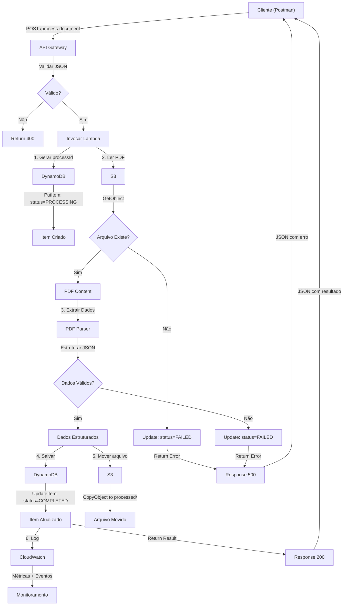

# Arquitetura — Sistema de Processamento de Documentos Sinistro

## Visão Geral


Sistema serverless para automatizar o processamento de PDFs de sinistro, transformando documentos não-estruturados em dados estruturados através de uma pipeline AWS.

```
┌─────────────┐      ┌──────────────┐      ┌────────────┐      ┌──────────┐
│   Cliente   │ ────→│ API Gateway  │ ────→│   Lambda   │ ────→│DynamoDB  │
│  (Postman)  │      │  (REST API)  │      │(Processor) │      │(Dados)   │
└─────────────┘      └──────────────┘      └────────────┘      └──────────┘
                                                   ↓
                                            ┌──────────────┐
                                            │  CloudWatch  │
                                            │   (Logs)     │
                                            └──────────────┘
```

---

## Componentes da Arquitetura

### 1. API Gateway
**Função**: Expor endpoint HTTP POST para receber requisições de processamento

- **Tipo**: REST API
- **Método**: POST
- **Rota**: `/process-document`
- **Entrada**: JSON com metadados do documento
- **Saída**: JSON com ID de processamento
- **Autenticação**: Sem autenticação (apenas para MVP)
- **CORS**: Habilitado para testes via Postman

**Modelo de Requisição:**
```json
{
  "fileName": "sinistro_20260617_001.pdf",
  "documentType": "sinistro",
  "metadata": {
    "claimNumber": "SC2026001",
    "claimDate": "2026-06-17",
    "customerName": "João Silva"
  }
}
```

**Modelo de Resposta:**
```json
{
  "status": "success",
  "processId": "proc_123abc456",
  "message": "Documento enviado para processamento",
  "estimatedTime": "30 segundos"
}
```

---

### 2. S3 (Simple Storage Service)
**Função**: Armazenar arquivos PDF enviados pelos usuários

- **Bucket**: `sinistro-docs-hack2hire-2026`
- **Estrutura de pastas**:
  ```
  sinistro-docs-hack2hire-2026/
  ├── incoming/          # PDFs aguardando processamento
  ├── processed/         # PDFs já processados
  └── rejected/          # PDFs com erro
  ```
- **Versionamento**: Desabilitado (não necessário para MVP)
- **Encriptação**: KMS (AWS managed)
- **Lifecycle Policy**: Limpar arquivos rejeitados após 30 dias

**Permissões**:
- Lambda: Ler/escrever em `incoming/` e `processed/`
- Usuários: Apenas leitura em `processed/` (via API)

---

### 3. Lambda
**Função**: Processador central — ler PDF, extrair dados, validar, armazenar

#### 3.1 Fluxo de Execução

```
1. Receber evento do API Gateway
   ↓
2. Validar entrada (JSON schema)
   ↓
3. Copiar PDF de entrada para S3
   ↓
4. Ler arquivo PDF do S3
   ↓
5. Extrair texto/dados brutos
   ↓
6. Parsear e estruturar dados
   ↓
7. Validar qualidade dos dados
   ↓
8. Salvar resultado em DynamoDB
   ↓
9. Registrar sucesso em CloudWatch
   ↓
10. Retornar resultado ao cliente
```

#### 3.2 Configuração

- **Runtime**: Python 3.12
- **Timeout**: 120 segundos (2 min)
- **Memory**: 512 MB (ajustar conforme necessário)
- **Variáveis de Ambiente**:
  ```
  DYNAMODB_TABLE_NAME=sinistros_resultados
  S3_BUCKET_NAME=sinistro-docs-hack2hire-2026
  AWS_REGION=us-east-1
  ```

#### 3.3 Dependências

```
boto3==1.28.0        # SDK AWS
PyPDF2==3.0.1        # Leitura de PDFs
python-dotenv==1.0.0 # Variáveis de ambiente
```

#### 3.4 Pseudocódigo

```python
def lambda_handler(event, context):
    """
    Processa documento sinistro enviado via API Gateway
    """
    try:
        # 1. Parsear entrada
        body = json.loads(event['body'])
        file_name = body['fileName']
        document_type = body['documentType']
        metadata = body['metadata']
        
        # 2. Validar
        if not file_name or not document_type:
            return error_response(400, "Dados incompletos")
        
        # 3. Gerar ID único
        process_id = generate_id()
        
        # 4. Criar entrada em DynamoDB
        dynamodb = boto3.resource('dynamodb')
        table = dynamodb.Table(os.getenv('DYNAMODB_TABLE_NAME'))
        
        table.put_item(Item={
            'processId': process_id,
            'fileName': file_name,
            'status': 'PROCESSING',
            'createdAt': datetime.now().isoformat(),
            'metadata': metadata
        })
        
        # 5. Ler PDF do S3
        s3 = boto3.client('s3')
        response = s3.get_object(
            Bucket=os.getenv('S3_BUCKET_NAME'),
            Key=f"incoming/{file_name}"
        )
        pdf_content = response['Body'].read()
        
        # 6. Extrair dados
        pdf_data = extract_pdf_data(pdf_content)
        
        # 7. Validar dados
        if not validate_data(pdf_data):
            update_status(process_id, 'FAILED', 'Dados inválidos')
            return error_response(400, "Falha na validação")
        
        # 8. Atualizar resultado
        table.update_item(
            Key={'processId': process_id},
            UpdateExpression='SET #status = :status, #data = :data, #updated = :updated',
            ExpressionAttributeNames={
                '#status': 'status',
                '#data': 'extractedData',
                '#updated': 'updatedAt'
            },
            ExpressionAttributeValues={
                ':status': 'COMPLETED',
                ':data': pdf_data,
                ':updated': datetime.now().isoformat()
            }
        )
        
        # 9. Mover arquivo processado
        s3.copy_object(
            CopySource=f"{os.getenv('S3_BUCKET_NAME')}/incoming/{file_name}",
            Bucket=os.getenv('S3_BUCKET_NAME'),
            Key=f"processed/{file_name}"
        )
        
        # 10. Log de sucesso
        print(f"Processamento bem-sucedido: {process_id}")
        
        return success_response(200, {
            'processId': process_id,
            'status': 'COMPLETED',
            'dataExtracted': pdf_data
        })
        
    except Exception as e:
        print(f"Erro: {str(e)}")
        return error_response(500, str(e))
```

---

### 4. DynamoDB
**Função**: Armazenar registros estruturados de documentos processados

#### 4.1 Tabela: `sinistros_resultados`

| Atributo | Tipo | Descrição | Chave |
|----------|------|-----------|-------|
| `processId` | String | ID único do processamento | Primária |
| `fileName` | String | Nome do arquivo PDF original | - |
| `status` | String | PROCESSING, COMPLETED, FAILED | - |
| `extractedData` | Map | Dados extraídos do PDF | - |
| `metadata` | Map | Metadados da requisição | - |
| `createdAt` | String | Timestamp de criação | GSI |
| `updatedAt` | String | Timestamp da última atualização | - |
| `error` | String | Mensagem de erro (se houver) | - |

#### 4.2 Configuração

- **Billing Mode**: PAY_PER_REQUEST (sem necessidade de capacity provisioning)
- **TTL**: 90 dias (cleanup automático de registros antigos)
- **GSI (Global Secondary Index)**:
  - `createdAt`: Para queries por data
  - `status`: Para queries por status

#### 4.3 Exemplo de Item

```json
{
  "processId": "proc_20260617_001",
  "fileName": "sinistro_20260617_001.pdf",
  "status": "COMPLETED",
  "extractedData": {
    "claimNumber": "SC2026001",
    "claimDate": "2026-06-17",
    "customerName": "João Silva",
    "claimAmount": "15000.00",
    "claimType": "Sinistro de Veículo",
    "description": "Colisão frontal em semáforo"
  },
  "metadata": {
    "claimNumber": "SC2026001",
    "claimDate": "2026-06-17",
    "customerName": "João Silva"
  },
  "createdAt": "2026-06-17T14:32:00Z",
  "updatedAt": "2026-06-17T14:32:45Z"
}
```

---

### 5. CloudWatch
**Função**: Monitoramento, logs e métricas

#### 5.1 Log Groups

- **Log Group**: `/aws/lambda/analisar-sinistro`
  - Captura todos os logs da função Lambda
  - Retenção: 7 dias (ajustável)

#### 5.2 Métricas

| Métrica | Descrição |
|---------|-----------|
| `Invocations` | Total de chamadas à Lambda |
| `Duration` | Tempo médio de processamento |
| `Errors` | Contagem de erros |
| `Throttles` | Vezes que Lambda foi throttled |
| `ConcurrentExecutions` | Execuções simultâneas |

#### 5.3 Alarmes (Recomendado)

```
- Erro rate > 5%: Enviar notificação
- Duration média > 60s: Alertar para ajuste de memory
- Throttles > 0: Aumentar capacity
```

---

## Fluxo de Dados Completo

```
ENTRADA                    PROCESSAMENTO                    SAÍDA
═══════════════════════════════════════════════════════════════════════════

Cliente (Postman)
    │
    └─→ POST /process-document
           (JSON metadata)
               │
               ↓
        API Gateway
               │
               └─→ Validação de entrada
                      │
                      ↓
               Lambda Trigger
                      │
                      ├─→ Gerar processId
                      │
                      ├─→ Criar item em DynamoDB
                      │     (status: PROCESSING)
                      │
                      ├─→ Ler PDF do S3
                      │
                      ├─→ Extrair dados/texto
                      │
                      ├─→ Validar campos obrigatórios
                      │
                      ├─→ Atualizar DynamoDB
                      │     (status: COMPLETED + dados)
                      │
                      ├─→ Mover PDF para pasta "processed"
                      │
                      └─→ Log em CloudWatch
                             │
                             ↓
                      DynamoDB + CloudWatch + S3
                             │
                             ↓
                      Resposta ao cliente
                      (JSON com processId)
```

---

## Processos de Tratamento de Erros

### Validação de Entrada

```
IF fileName NOT provided THEN
  → Return 400: "fileName obrigatório"

IF documentType NOT IN ['sinistro', 'documento', ...] THEN
  → Return 400: "documentType inválido"

IF metadata empty THEN
  → Return 400: "metadata obrigatório"
```

### Erro ao Ler PDF

```
IF S3 GetObject fails THEN
  → Update DynamoDB: status='FAILED', error='Arquivo não encontrado'
  → Return 500: "Falha ao processar documento"
  → Log em CloudWatch com stack trace
```

### Erro ao Processar Dados

```
IF PDF parser fails THEN
  → Update DynamoDB: status='FAILED', error='PDF corrompido ou ilegível'
  → Move arquivo para pasta "rejected"
  → Log em CloudWatch
  → Return 400: "Não foi possível extrair dados"

IF validation fails THEN
  → Update DynamoDB: status='FAILED', error='Dados incompletos'
  → Salvar dados brutos em campo "rawData"
  → Log em CloudWatch
  → Return 400: "Validação falhou"
```

### Retry Logic (Recomendado)

```
MAX_RETRIES = 3

FOR attempt IN 1..MAX_RETRIES:
  TRY:
    process_document()
  CATCH transient_error:
    IF attempt < MAX_RETRIES THEN
      WAIT 2^attempt seconds  # exponential backoff
      CONTINUE
    ELSE
      Update DynamoDB: status='FAILED', error='Max retries exceeded'
      BREAK
```

---

## Segurança e Permissões

### IAM Policy para Lambda

```json
{
  "Version": "2012-10-17",
  "Statement": [
    {
      "Effect": "Allow",
      "Action": [
        "s3:GetObject",
        "s3:PutObject",
        "s3:CopyObject"
      ],
      "Resource": "arn:aws:s3:::sinistro-docs-hack2hire-2026/*"
    },
    {
      "Effect": "Allow",
      "Action": [
        "dynamodb:PutItem",
        "dynamodb:UpdateItem",
        "dynamodb:GetItem",
        "dynamodb:Query"
      ],
      "Resource": "arn:aws:dynamodb:us-east-1:*:table/sinistros_resultados"
    },
    {
      "Effect": "Allow",
      "Action": [
        "logs:CreateLogGroup",
        "logs:CreateLogStream",
        "logs:PutLogEvents"
      ],
      "Resource": "arn:aws:logs:us-east-1:*:log-group:/aws/lambda/*"
    }
  ]
}
```

### Encriptação

- **S3**: Encriptação padrão com chaves AWS-managed
- **DynamoDB**: Encriptação com KMS (AWS-managed)
- **Comunicação**: HTTPS/TLS para API Gateway

### Autenticação (Futura)

Para produção, adicionar:
- API Key na API Gateway
- IAM roles por aplicação cliente
- Rate limiting para prevenir abuso

---

## Escalabilidade

### Lambda
- **Concorrência**: 1000 execuções simultâneas (padrão AWS)
- **Timeout**: 15 minutos máximo
- **Memory**: Escala de 128 MB a 10.240 MB

**Para mais load**:
```
→ Aumentar memory para melhorar CPU
→ Usar DynamoDB on-demand (já configurado)
→ Implementar fila SQS para processamento assíncrono
```

### DynamoDB (On-Demand)
- **Read/Write**: Escala automaticamente conforme demanda
- **Custo**: Paga por item processado
- **Latência**: Típicamente <10ms para gets

**Padrão de Query Recomendado**:
```
Query por processId (primary key) → O(1)
Query por status → Use GSI
Query por data → Use GSI createdAt
```

### S3
- **Escalabilidade**: Ilimitada (por design)
- **Latência**: <100ms típicamente
- **Throughput**: 3.500 PUT/DELETE por segundo por prefix

---

## Endpoints e URLs

| Serviço | Tipo | Endpoint |
|---------|------|----------|
| API Gateway | HTTP | `https://<api-id>.execute-api.us-east-1.amazonaws.com/prod/process-document` |
| Lambda | AWS Console | `https://console.aws.amazon.com/lambda/home?region=us-east-1` |
| DynamoDB | AWS Console | `https://console.aws.amazon.com/dynamodbv2/home?region=us-east-1` |
| S3 | AWS Console | `https://console.aws.amazon.com/s3/home?region=us-east-1` |
| CloudWatch Logs | AWS Console | `https://console.aws.amazon.com/cloudwatch/home?region=us-east-1` |

---

## Diagrama Detalhado (Mermaid)



---

## Próximas Etapas (Evolução)

### MVP+1: Fila de Processamento
```
Postman → API Gateway → SQS → Lambda Consumer → DynamoDB
```
**Benefício**: Processamento assíncrono, melhor escalabilidade

### MVP+2: Busca e Consultas
```
Novo Endpoint: GET /documents/{processId}
Novo Endpoint: GET /documents?status=COMPLETED&date=2026-06-17
```
**Benefício**: Recuperar resultados via API

### MVP+3: Dashboard
```
CloudWatch Dashboards → Métricas em tempo real
QuickSight → BI e relatórios
```
**Benefício**: Visualização de performance

---

## Checklist de Implementação

- [ ] Criar tabela DynamoDB (`sinistros_resultados`)
- [ ] Criar bucket S3 (`sinistro-docs-hack2hire-2026`)
- [ ] Criar função Lambda (`analisar-sinistro`)
- [ ] Criar API Gateway com rota POST
- [ ] Configurar IAM role para Lambda
- [ ] Implementar código de processamento em Python
- [ ] Testar Lambda via console AWS
- [ ] Testar API Gateway via Postman
- [ ] Configurar CloudWatch logs e métricas
- [ ] Documentar erro handling
- [ ] Deploy em ambiente de teste

---

**Arquitetura versão 1.0 — Hack2Hire 2026** 🚀
