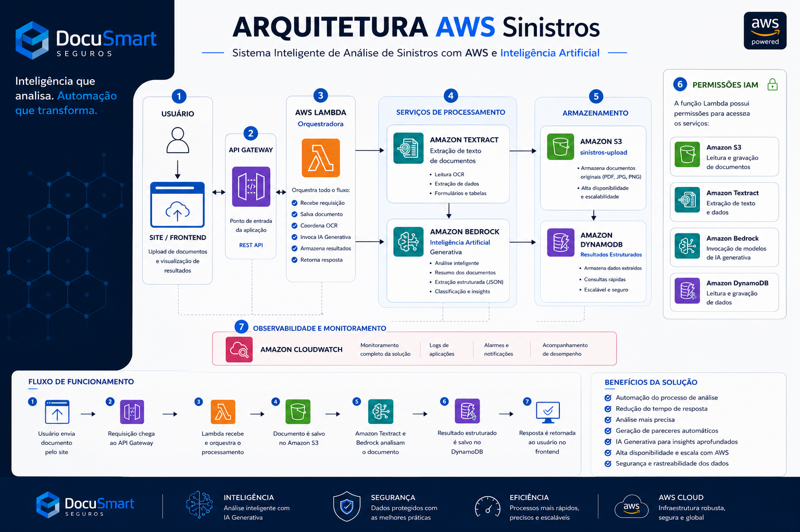
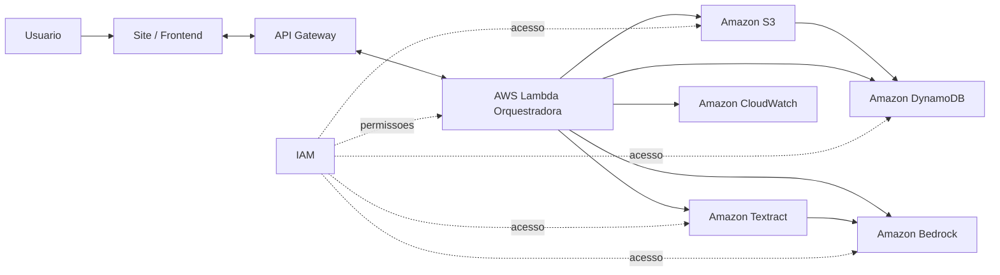

# Arquitetura AWS - DocuSmart Seguros

## Sistema inteligente de analise de sinistros com AWS e IA



Este documento descreve a arquitetura apresentada no material final do projeto DocuSmart Seguros. A imagem acima funciona como capa visual da arquitetura e resume o fluxo completo da solucao.

---

## 1. Visao Geral

A solucao foi desenhada como uma arquitetura serverless para processar documentos de sinistro usando servicos gerenciados da AWS e inteligencia artificial generativa.

O fluxo principal parte de um usuario que envia ou referencia um documento pelo frontend. A requisicao chega ao API Gateway, aciona uma Lambda orquestradora, utiliza Amazon Textract para extracao de texto e Amazon Bedrock para analise inteligente. Os documentos e resultados sao armazenados em S3 e DynamoDB, enquanto CloudWatch e IAM sustentam observabilidade e seguranca.

---

## 2. Fluxo de Alto Nivel



---

## 3. Componentes da Arquitetura

### 3.1 Usuario e Site / Frontend

O usuario acessa a interface DocuSmart Seguros para enviar documentos e visualizar resultados.

Responsabilidades:

- Permitir upload ou selecao do documento.
- Exibir status de processamento.
- Apresentar os campos estruturados retornados pela API.
- Apoiar a demonstracao visual da solucao.

No diagrama, essa camada representa a entrada do fluxo e a visualizacao final da resposta.

### 3.2 API Gateway

O API Gateway e o ponto de entrada da aplicacao.

Responsabilidades:

- Expor endpoint REST para o frontend ou ferramentas de teste.
- Receber a requisicao de processamento.
- Encaminhar a chamada para a Lambda.
- Padronizar a comunicacao HTTP entre cliente e backend.

Exemplo de entrada esperada:

```json
{
  "bucket": "sinistros-upload",
  "key": "documentos/boletim-ocorrencia.pdf",
  "metadata": {
    "origem": "frontend",
    "tipo_esperado": "sinistro"
  }
}
```

### 3.3 AWS Lambda Orquestradora

A Lambda e o componente central da arquitetura. Ela coordena todo o processamento.

Responsabilidades:

- Receber a requisicao do API Gateway.
- Validar parametros de entrada.
- Salvar ou localizar o documento no S3.
- Acionar OCR com Amazon Textract.
- Enviar o texto extraido para analise com Amazon Bedrock.
- Estruturar o resultado em JSON.
- Persistir o resultado no DynamoDB.
- Retornar a resposta ao frontend.
- Gerar logs de execucao para o CloudWatch.

No diagrama da apresentacao, a Lambda aparece como **orquestradora** porque coordena OCR, IA generativa, armazenamento e resposta.

### 3.4 Servicos de Processamento

#### Amazon Textract

O Textract realiza a leitura automatica dos documentos.

Responsabilidades:

- Extrair texto de PDFs, JPGs e PNGs.
- Ler conteudo por OCR.
- Identificar dados, formularios e tabelas quando aplicavel.
- Entregar texto bruto ou semiestruturado para a etapa de IA.

#### Amazon Bedrock / Amazon Nova

O Bedrock fornece a camada de inteligencia artificial generativa.

Responsabilidades:

- Analisar o texto extraido do documento.
- Classificar o tipo de documento.
- Gerar resumo da ocorrencia.
- Extrair campos em formato estruturado.
- Normalizar a resposta em JSON.
- Apoiar insights para analise de sinistros.

Essa camada atende diretamente ao criterio de uso de GenAI AWS no projeto.

### 3.5 Armazenamento

#### Amazon S3

O S3 armazena os documentos originais enviados para processamento.

Responsabilidades:

- Guardar arquivos PDF, JPG e PNG.
- Manter documentos disponiveis para a Lambda e o Textract.
- Oferecer alta disponibilidade e escalabilidade.
- Servir como repositorio de entrada do fluxo.

Nome usado no diagrama:

```text
sinistros-upload
```

#### Amazon DynamoDB

O DynamoDB armazena os resultados estruturados da analise.

Responsabilidades:

- Persistir os dados extraidos do documento.
- Armazenar status, resumo, campos e identificadores.
- Permitir consultas rapidas.
- Manter a rastreabilidade dos processamentos.

Exemplo de item salvo:

```json
{
  "id": "sin-001",
  "tipo_documento": "Boletim de Ocorrencia",
  "status": "processado",
  "campos_extraidos": {
    "data": "2026-06-15",
    "local": "Av. Paulista, 1000",
    "valor_prejuizo": "R$ 4.500,00",
    "envolvidos": ["Joao Silva", "Maria Souza"]
  },
  "resumo": "Acidente de transito com dois veiculos, sem vitimas fatais.",
  "processado_em": "2026-06-16T10:30:00Z"
}
```

### 3.6 Permissoes IAM

O IAM controla as permissoes usadas pela Lambda para acessar os demais servicos.

A Lambda precisa de permissoes para:

- Ler e gravar documentos no Amazon S3.
- Invocar o Amazon Textract.
- Invocar modelos no Amazon Bedrock.
- Ler e gravar dados no Amazon DynamoDB.
- Enviar logs para o Amazon CloudWatch.

Politica conceitual:

```json
{
  "Version": "2012-10-17",
  "Statement": [
    {
      "Effect": "Allow",
      "Action": ["s3:GetObject", "s3:PutObject"],
      "Resource": "arn:aws:s3:::sinistros-upload/*"
    },
    {
      "Effect": "Allow",
      "Action": ["textract:DetectDocumentText", "textract:AnalyzeDocument"],
      "Resource": "*"
    },
    {
      "Effect": "Allow",
      "Action": ["bedrock:InvokeModel"],
      "Resource": "*"
    },
    {
      "Effect": "Allow",
      "Action": ["dynamodb:PutItem", "dynamodb:GetItem", "dynamodb:Query", "dynamodb:Scan"],
      "Resource": "arn:aws:dynamodb:us-east-1:*:table/*"
    },
    {
      "Effect": "Allow",
      "Action": ["logs:CreateLogGroup", "logs:CreateLogStream", "logs:PutLogEvents"],
      "Resource": "*"
    }
  ]
}
```

Em uma versao produtiva, os recursos devem ser restringidos para ARNs especificos de bucket, tabela e modelo.

### 3.7 Observabilidade e Monitoramento

O Amazon CloudWatch centraliza logs e sinais operacionais da solucao.

Responsabilidades:

- Registrar logs da Lambda.
- Acompanhar erros de processamento.
- Medir duracao e quantidade de invocacoes.
- Apoiar alarmes e notificacoes.
- Facilitar depuracao durante testes e demonstracao.

Metricas recomendadas:

| Metrica | Objetivo |
|---|---|
| Invocations | Medir volume de requisicoes processadas. |
| Errors | Identificar falhas na Lambda. |
| Duration | Acompanhar tempo medio de processamento. |
| Throttles | Verificar limitacoes de concorrencia. |
| Logs por processo | Rastrear cada documento analisado. |

---

## 4. Fluxo de Funcionamento

O fluxo apresentado no diagrama segue sete etapas principais:

1. O usuario envia um documento pelo site.
2. A requisicao chega ao API Gateway.
3. A Lambda recebe a chamada e orquestra o processamento.
4. O documento e salvo ou localizado no Amazon S3.
5. Amazon Textract e Amazon Bedrock analisam o documento.
6. O resultado estruturado e salvo no DynamoDB.
7. A resposta e retornada ao usuario no frontend.

---

## 5. Contrato de Resposta

A resposta da API deve ser simples, estruturada e adequada para exibicao no frontend.

```json
{
  "status": "processado",
  "id": "sin-001",
  "arquivo": "boletim-ocorrencia.pdf",
  "resultado": {
    "tipo_documento": "Boletim de Ocorrencia",
    "resumo": "Acidente de transito com dois veiculos, sem vitimas fatais.",
    "campos_extraidos": {
      "data": "2026-06-15",
      "local": "Av. Paulista, 1000",
      "valor_prejuizo": "R$ 4.500,00",
      "envolvidos": ["Joao Silva", "Maria Souza"]
    }
  }
}
```

---

## 6. Beneficios da Arquitetura

### Automacao do processo de analise

O fluxo reduz leitura manual e acelera a triagem inicial dos documentos.

### Reducao do tempo de resposta

Lambda, Textract e Bedrock permitem processar documentos sob demanda, sem servidores dedicados.

### Analise mais precisa

OCR combinado com IA generativa melhora a classificacao e a estruturacao dos dados.

### Geracao de pareceres automaticos

O modelo pode resumir o documento e destacar informacoes relevantes para a equipe de sinistros.

### Alta disponibilidade e escala com AWS

S3, Lambda, DynamoDB e API Gateway sao servicos gerenciados e escalaveis.

### Seguranca e rastreabilidade dos dados

IAM define permissoes de acesso e CloudWatch registra eventos importantes do fluxo.

---

## 7. Decisoes de Arquitetura

| Decisao | Justificativa |
|---|---|
| Usar API Gateway como entrada | Facilita integracao com frontend e testes via Postman. |
| Usar Lambda como orquestradora | Mantem a solucao serverless e centraliza o fluxo de processamento. |
| Usar Textract para OCR | Permite ler documentos reais em PDF ou imagem. |
| Usar Bedrock / Nova para IA | Atende ao criterio de GenAI AWS e melhora a interpretacao dos dados. |
| Usar S3 para documentos | Armazenamento simples, duravel e escalavel. |
| Usar DynamoDB para resultados | Baixa latencia e modelo flexivel para JSON estruturado. |
| Usar CloudWatch | Garante observabilidade minima para testes e demonstracao. |
| Usar IAM | Aplica controle de acesso entre Lambda e servicos AWS. |

---

## 8. Evolucoes Futuras

Possiveis melhorias depois do MVP:

- Adicionar Amazon SQS para processamento assincrono.
- Criar Step Functions para orquestracao visual e retries controlados.
- Adicionar Amazon Cognito ou API Key para autenticacao.
- Criar dashboard com metricas de volume, tempo medio e erros.
- Implementar revisao humana para casos de baixa confianca.
- Adicionar busca semantica sobre documentos processados.
- Restringir politicas IAM para recursos especificos.
- Criar infraestrutura como codigo para reproducao do ambiente.

---

## 9. Conclusao

A arquitetura do DocuSmart Seguros combina frontend, API Gateway, Lambda, Textract, Bedrock, S3, DynamoDB, IAM e CloudWatch para criar uma solucao serverless de analise inteligente de documentos de sinistro.

O desenho atende ao Case C por usar agentes e inteligencia generativa em uma rotina operacional real, mantendo uma estrutura clara para demonstracao, persistencia dos resultados e evolucao futura.
