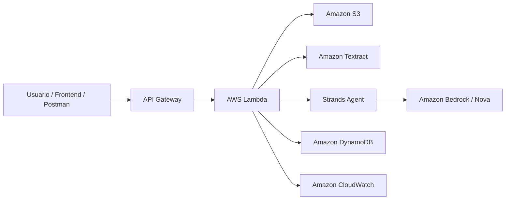

# Analise da Proposta - Case C

## DocuSmart Seguros - Processamento Inteligente de Documentos de Sinistro

**Evento:** Hack2Hire - Escola da Nuvem + AWS  
**Equipe:** Grupo 10  
**Case:** Case C - Solucoes operacionais com Strands Agents  
**Status da proposta:** proposta definida, apresentacao concluida e videos de demonstracao realizados

---

## 1. Resumo Executivo

A proposta escolhida para o Case C e a construcao de uma solucao serverless para automatizar a analise de documentos de sinistro. A solucao recebe documentos como boletins de ocorrencia, notas fiscais e laudos, extrai o conteudo com OCR, utiliza inteligencia generativa para classificar e estruturar as informacoes, e registra o resultado em formato padronizado para consulta e auditoria.

O projeto foi apresentado como **DocuSmart Seguros**, uma plataforma de apoio a equipes de sinistros que precisam reduzir retrabalho manual, acelerar a triagem documental e tornar os dados extraidos mais confiaveis para tomada de decisao.

A proposta se apoia diretamente em servicos AWS gerenciados e em recursos de GenAI:

- **Strands Agents SDK** para orquestrar o fluxo inteligente.
- **Amazon Textract** para extracao de texto de documentos.
- **Amazon Bedrock / Amazon Nova** para classificacao, normalizacao e estruturacao dos dados.
- **AWS Lambda** para execucao serverless.
- **Amazon S3** para armazenamento dos documentos.
- **Amazon DynamoDB** para persistencia dos resultados.
- **Amazon API Gateway** para exposicao do endpoint de processamento.
- **Amazon CloudWatch** para logs, rastreabilidade e acompanhamento tecnico.

---

## 2. Problema de Negocio

Empresas de seguros recebem grande volume de documentos relacionados a sinistros. Esses documentos chegam em formatos variados e exigem leitura manual para identificar informacoes como tipo de documento, data, local, valor estimado, envolvidos e resumo da ocorrencia.

Esse processo manual gera alguns impactos:

- Alto tempo de triagem inicial.
- Risco de erro na digitacao ou interpretacao dos dados.
- Dificuldade para manter historico estruturado dos casos.
- Baixa rastreabilidade sobre o que foi processado.
- Dependencia de analistas para tarefas repetitivas.

O Case C pede uma solucao aplicavel a rotinas operacionais reais. Por isso, o foco do DocuSmart e automatizar a entrada documental e entregar dados estruturados para que a equipe humana atue com mais velocidade e qualidade.

---

## 3. Solucao Proposta

A solucao implementa um fluxo de processamento de documentos com GenAI AWS. O usuario informa o documento a ser analisado, a Lambda busca o arquivo no S3, o Textract extrai o texto, o agente orquestrado com Strands envia o conteudo ao modelo no Bedrock, e o resultado final e salvo no DynamoDB.

O retorno esperado segue um JSON padronizado:

```json
{
  "id": "sinistro-123",
  "tipo_documento": "Boletim de Ocorrencia",
  "status": "processado",
  "campos_extraidos": {
    "data": "2026-06-15",
    "local": "Av. Paulista, 1000",
    "valor_prejuizo": "R$ 4.500,00",
    "envolvidos": ["Joao Silva", "Maria Souza"]
  },
  "resumo": "Acidente de transito com dois veiculos, sem vitimas fatais.",
  "processado_em": "2026-06-16T10:30:00Z"
}
```

Essa estrutura permite que os dados sejam consultados posteriormente, exportados, exibidos em uma interface ou integrados a sistemas internos de atendimento, regulacao ou auditoria.

---

## 4. Escopo Definido

### Incluido no MVP

- Recebimento de documentos armazenados no S3.
- Processamento via Lambda acionada por API Gateway.
- Extracao de texto com Amazon Textract.
- Classificacao e estruturacao com Amazon Bedrock.
- Orquestracao do fluxo com Strands Agents.
- Persistencia dos resultados em DynamoDB.
- Retorno padronizado em JSON.
- Logs de execucao no CloudWatch.
- Interface demonstrativa para apresentar upload, consulta, filtros e resultados.
- Apresentacao em PPT finalizada na pasta `Docs_uteis/Apresentacao`.
- Videos de demonstracao ja realizados.

### Fora do MVP

- Autenticacao completa de usuarios.
- Revisao humana integrada no fluxo.
- Dashboard analitico em producao.
- Busca semantica ou RAG sobre historico de sinistros.
- Esteira CI/CD automatizada.
- Ambiente multi-conta ou multi-regiao.

Esses itens ficam como evolucoes futuras, nao como pendencias da proposta apresentada.

---

## 5. Arquitetura Logica



### Fluxo resumido

1. O usuario seleciona ou informa o documento de sinistro.
2. A API recebe a requisicao e aciona a Lambda.
3. A Lambda localiza o documento no S3.
4. O Textract extrai o texto do documento.
5. O Strands Agent organiza a chamada ao modelo no Bedrock.
6. O modelo classifica o documento e devolve dados estruturados.
7. A Lambda salva o resultado no DynamoDB.
8. O sistema retorna um JSON com o status e os campos extraidos.

---

## 6. Justificativa Tecnica

### Por que Strands Agents

O Strands Agents SDK permite representar o fluxo como um agente operacional, capaz de chamar ferramentas especificas para extrair, classificar, validar e registrar informacoes. Isso conversa diretamente com o Case C, que pede solucoes operacionais com agentes.

### Por que Amazon Textract

Documentos de sinistro normalmente chegam como PDF ou imagem. O Textract resolve a primeira etapa critica: transformar documento visual em texto utilizavel. Sem OCR, o sistema dependeria de arquivos ja convertidos em texto, o que reduziria o valor pratico da solucao.

### Por que Amazon Bedrock / Nova

O Bedrock permite usar modelo generativo gerenciado pela AWS para interpretar o texto extraido, identificar o tipo do documento, resumir a ocorrencia e normalizar campos importantes. Isso atende ao criterio de uso de GenAI AWS e melhora a qualidade da classificacao em comparacao com regras fixas.

### Por que Lambda, S3 e DynamoDB

Esses servicos mantem a arquitetura simples, serverless e escalavel:

- S3 armazena documentos de entrada e historico.
- Lambda executa o processamento sob demanda.
- DynamoDB persiste resultados estruturados com baixa latencia.
- API Gateway expoe o fluxo para testes, frontend ou integracoes.
- CloudWatch centraliza logs e facilita demonstracao tecnica.

---

## 7. Beneficios Esperados

### Para o negocio

- Reducao do tempo de leitura inicial de documentos.
- Padronizacao dos dados extraidos.
- Melhor rastreabilidade dos processos.
- Apoio a analistas de sinistro em tarefas repetitivas.
- Base estruturada para futuras consultas e relatorios.

### Para a demonstracao

- Uso claro de servicos AWS gerenciados.
- Presenca de GenAI AWS no fluxo principal.
- Arquitetura serverless alinhada ao Well-Architected.
- Narrativa de negocio objetiva e facil de explicar.
- Demo visual com frontend, resposta JSON e persistencia em banco.

---

## 8. Alinhamento com os Criterios de Avaliacao

| Criterio | Como a proposta atende |
|---|---|
| Cliente e problema bem definidos | Foco em seguradoras e equipes de sinistro que lidam com documentos repetitivos. |
| Solucao adequada ao problema | Automatiza leitura, classificacao, estruturacao e registro dos documentos. |
| Uso de GenAI AWS | Utiliza Bedrock / Amazon Nova para normalizacao e interpretacao dos dados. |
| Uso de agentes | Strands Agents orquestra o fluxo e as ferramentas de processamento. |
| Servicos gerenciados/serverless | Usa Lambda, S3, DynamoDB, API Gateway, Textract e CloudWatch. |
| Beneficios comunicaveis | Reducao de retrabalho, ganho de velocidade e maior rastreabilidade. |
| Demonstracao funcional | Videos ja realizados e apresentacao concluida. |
| Evolucao futura | Permite adicionar dashboard, revisao humana e busca semantica. |

---

## 9. Limitacoes Conhecidas

Mesmo sendo adequada para o hackathon, a proposta ainda possui limitacoes naturais de MVP:

- O frontend funciona como camada demonstrativa e precisa de ajustes para uso produtivo.
- Autenticacao, controle de acesso e governanca fina nao fazem parte da entrega inicial.
- O custo de Textract e Bedrock deve ser controlado em um ambiente real.
- A qualidade da extracao depende da legibilidade dos documentos.
- Campos sensiveis exigiriam politicas adicionais de seguranca, mascaramento e retencao.

Essas limitacoes nao invalidam a proposta; elas delimitam o que foi priorizado para a entrega do hackathon.

---

## 10. Evolucoes Futuras

As principais evolucoes recomendadas sao:

- Adicionar fila SQS entre API Gateway e Lambda para processamento assincrono.
- Criar endpoint de consulta por `id`, `status`, data e tipo de documento.
- Implementar autenticacao com Cognito ou API Key.
- Adicionar revisao humana para casos de baixa confianca.
- Criar dashboard com metricas de volume, tempo medio e taxa de erro.
- Adicionar busca semantica sobre os documentos processados.
- Criar esteira de deploy com infraestrutura como codigo.

---

## 11. Conclusao

A proposta definida para o Case C e uma solucao de processamento inteligente de documentos de sinistro usando Strands Agents, Amazon Textract e Amazon Bedrock como nucleo de GenAI. A arquitetura se mantem serverless, escalavel e facil de demonstrar, com persistencia em DynamoDB e exposicao via API Gateway.

O DocuSmart Seguros atende ao problema operacional apresentado, usa servicos AWS relevantes para o criterio de avaliacao e oferece uma narrativa clara para a banca: transformar documentos nao estruturados em dados confiaveis para acelerar a rotina de analise de sinistros.
