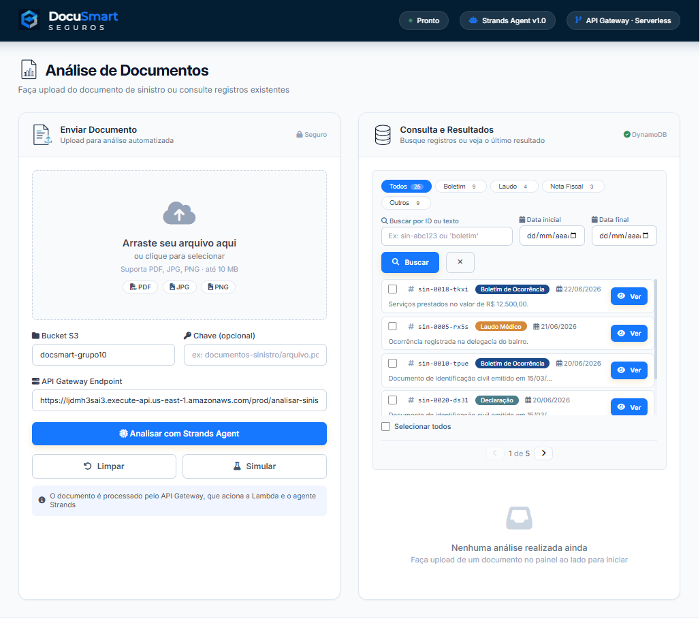

# DocuSmart Seguros



## Analise inteligente de documentos de sinistro com AWS e IA

O **DocuSmart Seguros** e uma solucao desenvolvida para o Hack2Hire - Escola da Nuvem + AWS. O projeto automatiza a analise inicial de documentos de sinistro, transformando arquivos nao estruturados em dados organizados, consultaveis e prontos para apoiar equipes de atendimento, sinistros e back office.

A proposta usa uma arquitetura serverless com servicos AWS gerenciados e inteligencia artificial generativa: o documento e recebido pelo frontend ou API, processado por uma Lambda orquestradora, lido com Amazon Textract, analisado com Amazon Bedrock / Nova e persistido no DynamoDB.

---

## Objetivo

Reduzir o trabalho manual na triagem de documentos de sinistro, acelerar o tempo de resposta e padronizar informacoes importantes como tipo de documento, data, local, valor estimado, envolvidos e resumo da ocorrencia.

---

## Funcionalidades

- Upload ou referencia de documentos de sinistro.
- Processamento via API Gateway e AWS Lambda.
- Extracao de texto com Amazon Textract.
- Analise inteligente com Amazon Bedrock / Nova.
- Orquestracao do fluxo com Strands Agents.
- Retorno em JSON estruturado.
- Persistencia dos resultados no Amazon DynamoDB.
- Logs e rastreabilidade com Amazon CloudWatch.
- Frontend demonstrativo para consulta, filtros, resultados e exportacao.

---

## Tecnologias

| Camada | Tecnologias |
|---|---|
| Frontend | HTML, CSS, JavaScript |
| Backend | Python, boto3, AWS Lambda |
| API | Amazon API Gateway |
| IA / OCR | Strands Agents, Amazon Textract, Amazon Bedrock / Nova |
| Armazenamento | Amazon S3 |
| Banco de dados | Amazon DynamoDB |
| Seguranca | AWS IAM |
| Observabilidade | Amazon CloudWatch |

---

## Arquitetura

A arquitetura final esta documentada com base no diagrama usado na apresentacao.

Resumo do fluxo:

1. Usuario envia ou referencia um documento no frontend.
2. API Gateway recebe a requisicao.
3. AWS Lambda orquestra o processamento.
4. Amazon S3 armazena o documento.
5. Amazon Textract extrai o texto.
6. Amazon Bedrock / Nova analisa e estrutura os dados.
7. Amazon DynamoDB salva o resultado.
8. Frontend exibe a resposta ao usuario.

Documento detalhado: [Arquitetura AWS - DocuSmart Seguros](Docs_uteis/Arquitetura.md)

---

## Estrutura do Repositorio

```text
Hack2Hire/
|-- Backend/
|   |-- lambda.py
|   `-- lambda_function_corrigida.py
|-- Frontend/
|   |-- index.html
|   |-- client/
|   |   |-- client.html
|   |   |-- client.css
|   |   `-- client.js
|   |-- analyst/
|   |   |-- analyst.html
|   |   |-- analyst.css
|   |   |-- analyst.js
|   |   |-- docUpload.html
|   |   |-- docUpload.css
|   |   |-- docUpload.js
|   |   `-- architecture.html
|   `-- assets/
|-- Docs_uteis/
|   |-- Apresentacao/
|   |-- Arquivos_teste/
|   |-- Cases/
|   |-- analise_proposta_case_c.md
|   |-- Arquitetura.md
|   |-- Requisitos_gerais.md
|   |-- Regras_de_avaliacao.md
|   `-- Diagrama_escopo_do_projeto.md
|-- assets/
|   `-- image/
`-- README.md
```

---

## Como Visualizar o Frontend

O frontend e estatico. A entrada principal esta reservada para a futura pagina institucional e comercial:

```text
Frontend/index.html
```

Para abrir o ambiente do cliente:

```text
Frontend/client/client.html
```

Para abrir o painel do analista:

```text
Frontend/analyst/analyst.html
```

Para abrir o modulo de upload e analise documental:

```text
Frontend/analyst/docUpload.html
```

Tambem e possivel servir a pasta `Frontend` com qualquer servidor local simples.

Observacao: o frontend funciona como camada demonstrativa do produto e da experiencia de uso. A integracao produtiva depende da URL do API Gateway configurada no ambiente AWS.

---

## Documentacao Detalhada

- [Analise da Proposta - Case C](Docs_uteis/analise_proposta_case_c.md)
- [Arquitetura AWS - DocuSmart Seguros](Docs_uteis/Arquitetura.md)
- [Requisitos Gerais](Docs_uteis/Requisitos_gerais.md)
- [Diagrama, Escopo e Arquitetura](Docs_uteis/Diagrama_escopo_do_projeto.md)
- [Regras de Avaliacao](Docs_uteis/Regras_de_avaliacao.md)
- [Conformidade da Lambda com a Arquitetura](Docs_uteis/Lambda_Conformidade_Arquitetura.md)
- [Verificacao da Lambda Corrigida](Docs_uteis/Verificacao_Lambda_Corrigida.md)

Materiais finais:

- [Apresentacao final](Docs_uteis/Apresentacao/)
- [Arquivos de teste](Docs_uteis/Arquivos_teste/)
- [Cases do desafio](Docs_uteis/Cases/)

---

## Status da Entrega

- Proposta definida com foco em Strands Agents, Textract e Bedrock.
- Arquitetura final documentada.
- Requisitos gerais atualizados.
- Frontend demonstrativo construido.
- Apresentacao final concluida na pasta `Docs_uteis/Apresentacao`.
- Videos de demonstracao realizados.

---

## Equipe

Grupo 10

- Jezebel de Oliveira Guedes
- Jose Antonio Farias Santos
- Krisley Ferreira de Almeida
- Elizeu Thenorio Rodrigues de Lima
- Felipe Jediel De Souza Oliveira
- Jose Matheus Dos Santos Neto
- Laisa Ferreira da Silva
- Leandro Vieira Goulart

---

## Agradecimentos

Agradecemos ao Hack2Hire, a Escola da Nuvem, aos mentores e a AWS pela oportunidade de desenvolver uma solucao pratica, alinhada a um problema real de negocio e aos principais conceitos de arquitetura serverless e inteligencia artificial generativa na nuvem.
