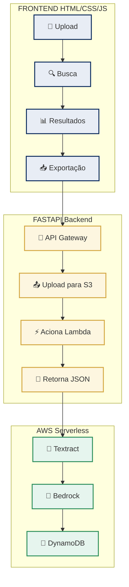

# DocuSmart Seguros

## 📋 Sobre o Projeto

O **DocuSmart Seguros** é uma aplicação frontend para automação da análise de documentos de sinistro. A interface permite upload de documentos, visualização de resultados, busca avançada e exportação de dados, integrando-se com o backend serverless da AWS.

---

## 🚀 Funcionalidades

| Módulo | Funcionalidades |
|--------|-----------------|
| **Upload** | Drag & Drop, suporte a PDF/JPG/PNG (10MB), validação de arquivos |
| **Análise** | Integração com agente Strands, simulação de dados mockados |
| **Busca** | Por ID, texto, tipo de documento, período de datas |
| **Filtros** | Tabs por tipo: Boletim, Laudo, Nota Fiscal, Outros |
| **Resultados** | Lista paginada, seleção em lote, visualização detalhada |
| **Exportação** | CSV individual, CSV em lote, relatório para impressão |
| **Visualização** | Modal com detalhes, preview do JSON no DynamoDB |

---

## 🛠️ Tecnologias Utilizadas

| Tecnologia | Versão | Finalidade |
|-----------|--------|------------|
| **HTML5** | - | Estrutura da aplicação |
| **CSS3** | - | Estilização e responsividade |
| **JavaScript** | ES6+ | Lógica e interatividade |
| **Font Awesome** | 6.5.1 | Ícones |
| **Google Fonts** | Inter | Tipografia |


---

## 📦 Instalação e Execução

### Pré-requisitos
- Navegador web moderno
- Conexão com a internet (para CDN)

### Passos

1. **Clone o repositório**
```bash
git clone https://github.com/LeandroGoulart/Hack2Hire.git
cd frontend
```

2. **Execute localmente**
 - **Opção 1:** Abrir diretamente
 Abra o arquivo `client/client.html` para o ambiente do cliente ou `analyst/docUpload.html` para o ambiente do analista.

- **Opção 2:** Servidor local
python -m http.server 8000

```bash
python -m http.server 8000
# Entrada futura: http://localhost:8000/
# Cliente: http://localhost:8000/client/client.html
# Painel do analista: http://localhost:8000/analyst/analyst.html
# Upload documental: http://localhost:8000/analyst/docUpload.html
# Arquitetura: http://localhost:8000/analyst/architecture.html
```

3. **Configure o endpoint**
O campo "FastAPI Endpoint" na interface permite configurar a URL do backend

Padrão: `http://localhost:8000/upload`

---

## 🔌 Integração com Backend

### Comunicação com FastAPI

A aplicação se comunica com o backend via requisições HTTP:

| Método | Endpoint | Descrição |
|--------|----------|-----------|
| POST | `/upload` | Upload e análise de documento |
| GET | `/sinistro/{id}` | Busca registro por ID |

### Exemplo de Resposta

```json
{
  "success": true,
  "data": {
    "id": "sin-0024-r3pv",
    "tipo_documento": "Nota Fiscal",
    "resumo": "Ocorrência registrada na delegacia do bairro.",
    "campos_extraidos": {
      "data": "09/06/2026",
      "local": "Av. Paulista, 1000 - São Paulo/SP",
      "valor": "R$ 5.309,21",
      "envolvidos": ["Ana Costa", "João Silva", "Camila Nunes"]
    },
    "processado_em": "2026-06-09T12:33:13.390Z"
  }
}
```
---

## 📊 Arquitetura Frontend


---

## 📱 Responsividade

| Dispositivo | Largura | Layout |
|------------|---------|--------|
| **Desktop** | > 1024px | Duas colunas |
| **Tablet** | 768-1024px | Uma coluna |
| **Mobile** | < 768px | Otimizado para touch |

---

## 🧪 Modo Simulação

A aplicação inclui um botão **"Simular"** que:

- Gera dados mockados aleatórios
- Permite testar a interface sem backend
- Útil para demonstrações e testes
